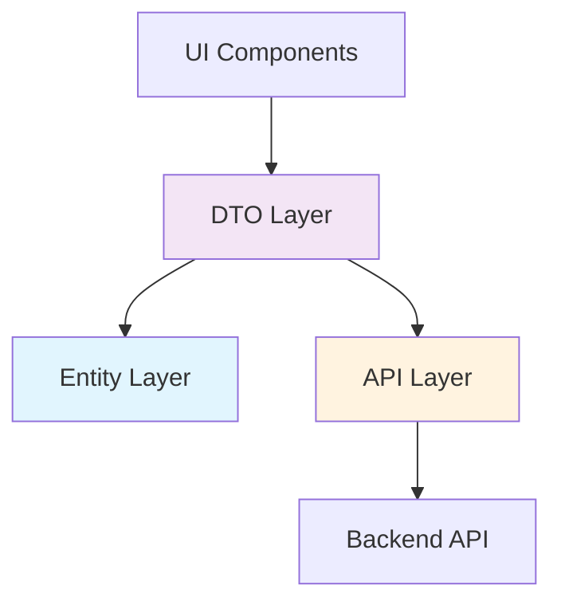

# DDD 구조 기반 타입 배치 가이드라인

## 📋 현재 프로젝트 DDD 구조 분석

### 🟢 잘 구성된 부분

- **폴더 구조**: `src/domains/`, `src/domains-ui/`, `src/pages-ui/`, `src/shared/` 기본 DDD 구조 완성
- **계층 분리**: UI 레이어와 도메인 레이어 분리
- **공통 모듈**: `src/shared/api/client.ts`에 공통 API 클라이언트 구현
- **유틸리티**: JWT 처리 유틸리티 구현

### 🟡 개선 필요한 부분

- **타입 정의**: 대부분의 타입이 컴포넌트 파일 내부에 인라인으로 정의됨
- **도메인 구현**:`src/domains/` 하위 폴더들이 대부분 비어있음
- **타입 중복**: 비슷한 타입들이 여러 파일에서 중복 정의
- **타입 관리**: 중앙화된 타입 관리 시스템 부족

### 🔴 구현되지 않은 부분

- 도메인별 타입 정의
- 도메인별 API 서비스
- 도메인별 비즈니스 로직 훅
- 타입 안전성을 위한 공통 유틸리티

---

## 🎯 타입 배치 전략

### 1. 도메인별 타입 분류

#### 1.1 Auth 도메인 (`src/domains/auth/types/`)

```typescript
// auth.ts - 인증 관련 핵심 타입
export interface AuthState {
  accessToken: string;
  refreshToken: string;
  sessionToken: string;
  userId: string;
  isAuthenticated: boolean;
}

export interface TokenSet {
  accessToken: string;
  refreshToken: string;
  sessionToken: string;
}

// login.ts - 로그인 관련 타입
export interface LoginParams {
  nationalNumber: string;
  phoneNumber: string;
  password: string;
}

export interface LoginFormState extends LoginParams {
  isLoading: boolean;
  errorMessage: string;
}

// join.ts - 회원가입 관련 타입
export interface JoinParams {
  accountType: string;
  agreeMarketing: number;
  emoticonId: number;
  // ... 기타 필드들
}

// index.ts - 도메인 타입 통합 내보내기
export * from "./auth";
export * from "./login";
export * from "./join";
```

#### 1.2 Profile 도메인 (`src/domains/profile/types/`)

```typescript
// profile.ts - 프로필 관련 핵심 타입
export interface UserProfile {
  profileId: number;
  profileName: string;
  profileKind: string;
  profileOriginal: string;
  profileThumbnail: string;
  profileSmallThumbnail: string;
  emoticonId: number;
}

export interface AccountProfile {
  profile: UserProfile;
  accountType: string;
  friendRelationMode: string;
  position?: string;
  department?: string;
  statusMessage?: string;
}

// ui.ts - UI 컴포넌트용 타입
export interface ProfileCardProps {
  id: string;
  name: string;
  position: string;
  department: string;
  profileImage?: string;
  statusMessage?: string;
  badgeText?: string;
  badgeColor?: "default" | "processing" | "success" | "error" | "warning";
  onMessageClick?: (userId: string) => void;
  onEditClick?: () => void;
  className?: string;
}

export interface UserCardProps {
  id: string;
  name: string;
  profileImage?: string;
  status?: "online" | "offline";
  statusText?: string;
  description?: string;
  badgeText?: string;
  badgeColor?: "default" | "processing" | "success" | "error" | "warning";
  onMessageClick?: (userId: string) => void;
  className?: string;
}
```

#### 1.3 Organization 도메인 (`src/domains/organization/types/`)

```typescript
// organization.ts - 조직 관련 핵심 타입
export interface Organization {
  id: string;
  name: string;
  description?: string;
  memberCount: number;
  departments: Department[];
}

export interface Department {
  id: string;
  name: string;
  members: OrganizationMember[];
}

export interface OrganizationMember {
  id: string;
  name: string;
  profileImage?: string;
  position: string;
  department: string;
  email?: string;
  phone?: string;
  status: "online" | "offline" | "busy" | "away";
  lastSeen?: Date;
}

// ui.ts - UI 컴포넌트용 타입
export type OrganizationTabType = "organization" | "customers" | "family";

export interface OrganizationHeaderProps {
  userName: string;
  onChatClick: () => void;
  onSettingsClick: () => void;
}

export interface OrganizationTabNavProps {
  activeTab: OrganizationTabType;
  onTabChange: (tab: OrganizationTabType) => void;
}
```

### 2. API 통신 타입 분리 전략 ⭐

> **핵심 아이디어**: Entity, DTO, Request/Response를 명확히 분리하여 도메인 순수성 보장

#### 2.1 타입 레이어별 역할 정의



#### 2.2 Entity vs DTO vs API 타입 분리

```typescript
// 🏗️ ENTITY (도메인 핵심 모델) - src/domains/profile/types/entities.ts
export interface UserEntity {
  id: string;
  name: string;
  email: string;
  profile: ProfileEntity;
  // 도메인 로직에 필요한 메서드들
  isActive(): boolean;
  hasPermission(permission: string): boolean;
  // 항상 Date 객체 사용
  createdAt: Date;
  updatedAt: Date;
}

export interface ProfileEntity {
  id: string;
  userId: string;
  profileImage: string;
  position: string;
  department: string;
  statusMessage?: string;
  emoticonId: number;
  // 도메인별 비즈니스 로직
  getDisplayName(): string;
  isOnline(): boolean;
}

// 📦 DTO (API 통신용) - src/domains/profile/types/dto.ts
export interface UserDTO {
  id: string;
  name: string;
  email: string;
  profileImage: string;
  position: string;
  department: string;
  statusMessage?: string;
  emoticonId: number;
  isActive: boolean;
  permissions: string[];
  // API에서 오는 문자열 형태
  createdAt: string; // ISO string
  updatedAt: string; // ISO string
}

export interface ProfileUpdateDTO {
  profileImage?: string;
  position?: string;
  department?: string;
  statusMessage?: string;
  emoticonId?: number;
}

// 🔄 API REQUEST/RESPONSE - src/domains/profile/types/api.ts
export interface GetUserRequest {
  userId: string;
  includeProfile?: boolean;
}

export interface GetUserResponse {
  success: boolean;
  data: UserDTO;
  message?: string;
}

export interface UpdateProfileRequest {
  userId: string;
  profileData: ProfileUpdateDTO;
}

export interface UpdateProfileResponse {
  success: boolean;
  data: UserDTO;
  message?: string;
}

// 리스트 조회용
export interface GetUsersRequest {
  departmentId?: string;
  page: number;
  limit: number;
  searchQuery?: string;
  sortBy?: "name" | "createdAt" | "position";
  sortOrder?: "asc" | "desc";
}

export interface GetUsersResponse {
  success: boolean;
  data: UserDTO[];
  pagination: {
    page: number;
    limit: number;
    total: number;
    totalPages: number;
    hasNext: boolean;
    hasPrev: boolean;
  };
}
```

#### 2.3 도메인별 타입 폴더 구조 (확장)

```typescript
src/domains/
├── auth/types/
│   ├── entities.ts        # AuthUser, Session 등 도메인 엔티티
│   ├── dto.ts            # LoginDTO, TokenDTO 등 전송 객체
│   ├── api.ts            # LoginRequest/Response, RefreshRequest/Response
│   ├── ui.ts             # 컴포넌트 Props 타입
│   └── index.ts          # 타입 통합 내보내기

├── profile/types/
│   ├── entities.ts        # UserEntity, ProfileEntity
│   ├── dto.ts            # UserDTO, ProfileDTO
│   ├── api.ts            # Profile 관련 Request/Response
│   ├── ui.ts             # ProfileCard, UserCard Props
│   └── index.ts

├── organization/types/
│   ├── entities.ts        # Organization, Department, Member
│   ├── dto.ts            # OrganizationDTO, DepartmentDTO
│   ├── api.ts            # Organization 관련 Request/Response
│   ├── ui.ts             # Organization 컴포넌트 Props
│   └── index.ts

└── chat/types/ (예정)
    ├── entities.ts        # ChatRoom, Message 등
    ├── dto.ts            # SendBird 연동용 DTO
    ├── api.ts            # Chat 관련 Request/Response
    └── index.ts
```

#### 2.4 공통 API 타입 (`src/shared/types/`)

```typescript
// api.ts - API 공통 기반 타입
export interface BaseApiResponse<T = any> {
  success: boolean;
  data: T;
  message?: string;
  errorCode?: string;
  timestamp?: string;
}

export interface BaseApiRequest {
  requestId?: string;
  clientVersion?: string;
}

export interface PaginationRequest {
  page: number;
  limit: number;
  sort?: string;
  order?: "asc" | "desc";
}

export interface PaginatedResponse<T> {
  success: boolean;
  data: T[];
  pagination: {
    page: number;
    limit: number;
    total: number;
    totalPages: number;
    hasNext: boolean;
    hasPrev: boolean;
  };
  message?: string;
}

// error.ts - 에러 타입 체계화
export interface ApiError {
  code: string;
  message: string;
  details?: Record<string, any>;
  timestamp?: string;
  traceId?: string;
}

export interface ValidationError {
  field: string;
  message: string;
  value?: any;
  constraint?: string;
}

export interface ApiErrorResponse {
  success: false;
  error: ApiError;
  message: string;
  validationErrors?: ValidationError[];
}

// entities.ts - 공통 엔티티 베이스
export interface BaseEntity {
  id: string;
  createdAt: Date;
  updatedAt: Date;
  version?: number; // 낙관적 락을 위한 버전
}

export interface BaseDTO {
  id: string;
  createdAt: string; // ISO string
  updatedAt: string; // ISO string
  version?: number;
}

// mapper.ts - DTO ↔ Entity 변환 타입
export interface Mapper<Entity, DTO> {
  toEntity(dto: DTO): Entity;
  toDTO(entity: Entity): DTO;
  toEntities(dtos: DTO[]): Entity[];
  toDTOs(entities: Entity[]): DTO[];
}

// common.ts - 범용 유틸리티 타입
export interface SelectOption<T = string> {
  label: string;
  value: T;
  disabled?: boolean;
  icon?: string;
  description?: string;
}

export type LoadingState = "idle" | "loading" | "success" | "error";
export type ApiStatus = "pending" | "fulfilled" | "rejected";

export interface AsyncState<T> {
  data: T | null;
  loading: boolean;
  error: string | null;
  lastFetch?: Date;
}
```

#### 2.5 Mapper 패턴 구현 예시

```typescript
// src/domains/profile/mappers/userMapper.ts
import { UserEntity, ProfileEntity } from "../types/entities";
import { UserDTO } from "../types/dto";
import { Mapper } from "@/shared/types";

export class UserMapper implements Mapper<UserEntity, UserDTO> {
  toEntity(dto: UserDTO): UserEntity {
    return {
      id: dto.id,
      name: dto.name,
      email: dto.email,
      profile: {
        id: dto.id, // 같은 ID 사용
        userId: dto.id,
        profileImage: dto.profileImage,
        position: dto.position,
        department: dto.department,
        statusMessage: dto.statusMessage,
        emoticonId: dto.emoticonId,
        // 도메인 메서드 구현
        getDisplayName: () => `${dto.name} (${dto.position})`,
        isOnline: () => true, // 실제로는 상태 확인 로직
      },
      // 도메인 메서드 구현
      isActive: () => dto.isActive,
      hasPermission: (permission: string) =>
        dto.permissions.includes(permission),
      // Date 변환
      createdAt: new Date(dto.createdAt),
      updatedAt: new Date(dto.updatedAt),
    };
  }

  toDTO(entity: UserEntity): UserDTO {
    return {
      id: entity.id,
      name: entity.name,
      email: entity.email,
      profileImage: entity.profile.profileImage,
      position: entity.profile.position,
      department: entity.profile.department,
      statusMessage: entity.profile.statusMessage,
      emoticonId: entity.profile.emoticonId,
      isActive: entity.isActive(),
      permissions: [], // 별도 조회 필요
      // string 변환
      createdAt: entity.createdAt.toISOString(),
      updatedAt: entity.updatedAt.toISOString(),
    };
  }

  toEntities(dtos: UserDTO[]): UserEntity[] {
    return dtos.map((dto) => this.toEntity(dto));
  }

  toDTOs(entities: UserEntity[]): UserDTO[] {
    return entities.map((entity) => this.toDTO(entity));
  }
}

// 싱글톤 인스턴스 생성
export const userMapper = new UserMapper();
```

#### 2.6 실제 사용 예시 (API 서비스에서)

```typescript
// src/domains/profile/api/profileApi.ts
import { get, post, put } from "@/shared/api/client";
import {
  GetUserRequest,
  GetUserResponse,
  UpdateProfileRequest,
} from "../types/api";
import { UserEntity } from "../types/entities";
import { userMapper } from "../mappers/userMapper";

export class ProfileApiService {
  async getUser(request: GetUserRequest): Promise<UserEntity> {
    // 1. API 호출 (DTO 반환)
    const response = await get<GetUserResponse>({
      url: `/users/${request.userId}`,
      params: { includeProfile: request.includeProfile },
    });

    // 2. DTO → Entity 변환
    return userMapper.toEntity(response.data);
  }

  async updateProfile(request: UpdateProfileRequest): Promise<UserEntity> {
    const response = await put<UpdateProfileResponse>({
      url: `/users/${request.userId}/profile`,
      data: request.profileData,
    });

    return userMapper.toEntity(response.data);
  }

  async getUsers(departmentId?: string): Promise<UserEntity[]> {
    const response = await get<GetUsersResponse>({
      url: "/users",
      params: { departmentId },
    });

    // 배열 변환
    return userMapper.toEntities(response.data);
  }
}

export const profileApi = new ProfileApiService();
```

#### 2.7 Hook에서의 활용

```typescript
// src/domains/profile/hooks/useProfile.ts
import { useQuery, useMutation, useQueryClient } from "@tanstack/react-query";
import { profileApi } from "../api/profileApi";
import { UserEntity } from "../types/entities";

export const useProfile = (userId: string) => {
  return useQuery({
    queryKey: ["profile", userId],
    queryFn: () => profileApi.getUser({ userId, includeProfile: true }),
    // 이미 Entity로 변환된 데이터 사용
    select: (data: UserEntity) => ({
      ...data,
      displayName: data.profile.getDisplayName(),
      canEdit: data.hasPermission("profile:edit"),
    }),
  });
};

export const useUpdateProfile = () => {
  const queryClient = useQueryClient();

  return useMutation({
    mutationFn: profileApi.updateProfile,
    onSuccess: (updatedUser: UserEntity) => {
      // 캐시 업데이트
      queryClient.setQueryData(["profile", updatedUser.id], updatedUser);
    },
  });
};
```

### 3. UI 공통 타입 (`src/shared-ui/types/`)

```typescript
// component.ts - 컴포넌트 공통 타입
export interface BaseComponentProps {
  className?: string;
  children?: React.ReactNode;
  testId?: string;
}

export interface ButtonProps extends BaseComponentProps {
  variant?: "primary" | "secondary" | "outline" | "ghost";
  size?: "sm" | "md" | "lg";
  disabled?: boolean;
  loading?: boolean;
  onClick?: () => void;
}

export interface ModalProps extends BaseComponentProps {
  isOpen: boolean;
  onClose: () => void;
  title?: string;
  size?: "sm" | "md" | "lg" | "xl";
}

// form.ts - 폼 관련 공통 타입
export interface FormFieldProps<T = any> {
  name: string;
  label?: string;
  placeholder?: string;
  required?: boolean;
  disabled?: boolean;
  value?: T;
  onChange?: (value: T) => void;
  error?: string;
  helperText?: string;
}

export interface FormState<T = Record<string, any>> {
  values: T;
  errors: Record<keyof T, string>;
  touched: Record<keyof T, boolean>;
  isValid: boolean;
  isSubmitting: boolean;
}
```

---

## 📁 권장 파일 구조

### 도메인별 구조

```
src/domains/
├── auth/
│   ├── types/
│   │   ├── auth.ts          # 인증 핵심 타입
│   │   ├── login.ts         # 로그인 관련 타입
│   │   ├── join.ts          # 회원가입 관련 타입
│   │   └── index.ts         # 타입 통합 내보내기
│   ├── api/
│   │   ├── authApi.ts       # 인증 API
│   │   ├── loginApi.ts      # 로그인 API
│   │   └── index.ts
│   ├── hooks/
│   │   ├── useAuth.ts       # 인증 상태 관리 훅
│   │   ├── useLogin.ts      # 로그인 훅
│   │   └── index.ts
│   └── utils/
│       ├── jwt.ts           # JWT 유틸리티
│       ├── token.ts         # 토큰 관리
│       └── validation.ts    # 유효성 검사
```

### 공통 구조

```
src/shared/
├── types/
│   ├── api.ts               # API 공통 타입
│   ├── error.ts             # 에러 타입
│   ├── common.ts            # 범용 타입
│   └── index.ts
├── api/
│   ├── client.ts            # API 클라이언트
│   ├── interceptors.ts      # 인터셉터
│   └── queryKeys.ts         # React Query 키
└── utils/
    ├── validation.ts        # 공통 유효성 검사
    ├── format.ts            # 데이터 포맷팅
    └── date.ts              # 날짜 유틸리티
```

### UI 구조

```
src/shared-ui/
├── types/
│   ├── component.ts         # 컴포넌트 공통 타입
│   ├── form.ts              # 폼 관련 타입
│   └── index.ts
└── components/
    ├── Button/
    ├── Modal/
    └── Form/

src/domains-ui/
├── profile/
│   ├── types.ts             # 프로필 UI 전용 타입
│   ├── MyProfileCard/
│   └── index.ts
└── organization/
    ├── types.ts             # 조직 UI 전용 타입
    ├── UserCard/
    └── index.ts
```

---

## 🔄 타입 이전 계획

### 1단계: 기존 타입 분석 및 추출

- [ ] 현재 컴포넌트 파일에서 타입 정의 추출
- [ ] 중복된 타입 식별 및 통합 계획 수립
- [ ] 도메인별 타입 분류

### 2단계: 도메인별 타입 파일 생성

- [ ] `src/domains/auth/types/` 폴더 생성 및 타입 정의
- [ ] `src/domains/profile/types/` 폴더 생성 및 타입 정의
- [ ] `src/domains/organization/types/` 폴더 생성 및 타입 정의

### 3단계: 공통 타입 정리

- [ ] `src/shared/types/` 폴더 생성 및 공통 타입 정의
- [ ] `src/shared-ui/types/` 폴더 생성 및 UI 공통 타입 정의

### 4단계: 기존 파일 수정

- [ ] 컴포넌트 파일에서 타입 import로 변경
- [ ] 타입 중복 제거
- [ ] 타입 안전성 개선

### 5단계: 문서화 및 가이드라인 정리

- [ ] 타입 네이밍 컨벤션 문서화
- [ ] 새로운 타입 추가 시 가이드라인 작성

---

## 📋 타입 네이밍 컨벤션

### 기본 규칙

- **Interface**: PascalCase (예: `UserProfile`, `LoginParams`)
- **Type Alias**: PascalCase (예: `OrganizationTabType`)
- **Enum**: PascalCase (예: `UserStatus`)
- **Generic**: 단일 대문자 (예: `T`, `K`, `V`)

### 접미사 규칙

- **Props**: 컴포넌트 props는 `Props` 접미사 (예: `UserCardProps`)
- **Params**: API 파라미터는 `Params` 접미사 (예: `LoginParams`)
- **Response**: API 응답은 `Response` 접미사 (예: `LoginResponse`)
- **State**: 상태는 `State` 접미사 (예: `AuthState`)
- **Config**: 설정은 `Config` 접미사 (예: `ApiConfig`)

### 도메인별 접두사

- Auth 관련: `Auth`, `Login`, `Join`
- Profile 관련: `Profile`, `User`, `Account`
- Organization 관련: `Organization`, `Department`, `Member`
- UI 관련: 컴포넌트명 기반

---

## 🎯 예상 효과

### 1. 개발 효율성 향상

- **타입 재사용**: 중복 타입 제거로 코드 중복 감소
- **자동완성**: IDE에서 더 정확한 타입 추천
- **에러 감소**: 컴파일 타임에 타입 오류 사전 발견

### 2. 코드 품질 향상

- **일관성**: 프로젝트 전반의 타입 일관성 확보
- **가독성**: 명확한 타입 정의로 코드 이해도 향상
- **유지보수성**: 타입 변경 시 영향 범위 최소화

### 3. 협업 효율성 향상

- **문서화**: 타입 자체가 API 문서 역할
- **커뮤니케이션**: 타입을 통한 명확한 인터페이스 정의
- **온보딩**: 새 팀원의 코드베이스 이해 시간 단축

---

---

## 💡 현재 프로젝트 타입 추출 및 재구성 예시

### 기존 코드에서 추출된 타입들

#### 1. Profile 도메인 타입 재구성

```typescript
// src/domains/profile/types/profile.ts
export interface UserProfile {
  id: string;
  name: string;
  position: string;
  department: string;
  profileImage?: string;
  statusMessage?: string;
  status?: "online" | "offline" | "busy" | "away";
  lastSeen?: Date;
  email?: string;
  phone?: string;
}

// src/domains/profile/types/ui.ts
export interface ProfileBadge {
  text: string;
  color: "default" | "processing" | "success" | "error" | "warning";
}

export interface BaseProfileCardProps {
  id: string;
  name: string;
  profileImage?: string;
  className?: string;
  onMessageClick?: (userId: string) => void;
}

export interface MyProfileCardProps extends BaseProfileCardProps {
  position: string;
  department: string;
  statusMessage?: string;
  badgeText?: string;
  badgeColor?: ProfileBadge["color"];
  onEditClick?: () => void;
}

export interface UserCardProps extends BaseProfileCardProps {
  status?: UserProfile["status"];
  statusText?: string;
  description?: string;
  badgeText?: string;
  badgeColor?: ProfileBadge["color"];
}
```

#### 2. Organization 도메인 타입 재구성

```typescript
// src/domains/organization/types/organization.ts
export interface OrganizationMember extends UserProfile {
  memberType: "employee" | "manager" | "admin";
  joinedAt: Date;
  permissions: string[];
}

export interface Department {
  id: string;
  name: string;
  description?: string;
  members: OrganizationMember[];
  managerIds: string[];
}

export interface Organization {
  id: string;
  name: string;
  description?: string;
  departments: Department[];
  totalMembers: number;
  settings: OrganizationSettings;
}

export interface OrganizationSettings {
  allowGuestAccess: boolean;
  defaultRole: string;
  chatEnabled: boolean;
  notificationsEnabled: boolean;
}

// src/domains/organization/types/ui.ts
export type OrganizationTabType = "organization" | "customers" | "family";

export interface OrganizationHeaderProps {
  userName: string;
  organizationName?: string;
  onChatClick: () => void;
  onSettingsClick: () => void;
  onProfileClick?: () => void;
}

export interface OrganizationTabNavProps {
  activeTab: OrganizationTabType;
  onTabChange: (tab: OrganizationTabType) => void;
  tabCounts?: Record<OrganizationTabType, number>;
}

export interface OrganizationTabProps {
  onMessageClick: (userId: string) => void;
  loading?: boolean;
  searchQuery?: string;
  onSearchChange?: (query: string) => void;
}
```

### 이전 계획 (Migration Plan)

#### Step 1: 기존 타입 분석 완료 ✅

```bash
# 현재 발견된 인라인 타입들
- MyProfileCardProps (MyProfileCard.tsx)
- UserCardProps (UserCard.tsx)
- OrganizationTabType (OrganizationPage.tsx)
- JWTPayload (jwt.ts)
```

#### Step 2: 도메인별 타입 파일 생성 (권장사항)

```bash
# 생성할 파일 구조
src/domains/
├── profile/types/
│   ├── profile.ts       # 핵심 프로필 타입
│   ├── ui.ts           # UI 컴포넌트 전용 타입
│   └── index.ts        # 타입 내보내기
├── organization/types/
│   ├── organization.ts  # 조직 핵심 타입
│   ├── ui.ts           # UI 컴포넌트 전용 타입
│   └── index.ts
└── auth/types/
    ├── auth.ts         # 인증 핵심 타입
    ├── jwt.ts          # JWT 관련 타입
    └── index.ts
```

#### Step 3: 타입 이전 스크립트 예시

```typescript
// Before: MyProfileCard.tsx
export interface MyProfileCardProps {
  id: string;
  name: string;
  // ... 기타 props
}

// After: MyProfileCard.tsx
import { MyProfileCardProps } from "@/domains/profile/types";
// or
import type { MyProfileCardProps } from "@/domains/profile/types/ui";

export function MyProfileCard(props: MyProfileCardProps) {
  // 컴포넌트 로직
}
```

---

## 🚀 다음 단계

### 현재 프로젝트 적용 방법 (BFF 구조 기반)

#### 현재 API 구조 분석

```typescript
// 현재: src/shared/api/client.ts
// BFF를 통해 "/api/familytown" 엔드포인트 사용
// 쿠키 기반 인증으로 토큰 관리 자동화
```

#### 권장 적용 순서

```typescript
// Step 1: 공통 타입 먼저 생성
src/shared/types/
├── api.ts              # BaseApiResponse, PaginationRequest 등
├── error.ts            # ApiError, ValidationError 등
├── entities.ts         # BaseEntity, BaseDTO 등
└── index.ts            # 통합 export

// Step 2: 각 도메인별로 현재 사용되는 타입부터 추출
// 현재 MyProfileCard, UserCard에서 사용중인 타입들
src/domains/profile/types/
├── entities.ts         # UserEntity, ProfileEntity
├── dto.ts             # 현재 API에서 오는 실제 응답 형태
├── api.ts             # BFF 엔드포인트별 Request/Response
├── ui.ts              # MyProfileCardProps, UserCardProps
└── index.ts

// Step 3: API 서비스 레이어 구현
src/domains/profile/api/
├── profileApi.ts       # BFF 호출용 API 서비스
└── index.ts

// Step 4: Mapper 구현
src/domains/profile/mappers/
├── userMapper.ts       # DTO ↔ Entity 변환
└── index.ts
```

#### BFF 구조에 맞는 API 타입 예시

```typescript
// src/domains/auth/types/api.ts - 현재 BFF 구조 반영
export interface LoginRequest {
  nationalNumber: string;
  phoneNumber: string;
  password: string;
}

// BFF에서 실제 반환하는 구조
export interface LoginResponse {
  resultData: {
    accessToken: string;
    refreshToken: string;
    sessionToken: string;
    sendBirdId: string;
    accountProfile: {
      profile: {
        profileId: number;
        profileName: string;
        profileKind: string;
        profileOriginal: string;
        profileThumbnail: string;
        profileSmallThumbnail: string;
        emoticonId: number;
      };
      accountType: string;
      friendRelationMode: string;
    };
  };
}

// src/domains/profile/api/profileApi.ts - 실제 BFF 호출
import { get, post } from "@/shared/api/client";

export class ProfileApiService {
  // BFF 엔드포인트 호출
  async getMyProfile() {
    return await get({
      url: "/account/profile", // /api/familytown/account/profile
    });
  }

  async updateProfile(profileData: any) {
    return await post({
      url: "/account/profile",
      data: profileData,
    });
  }
}
```

### 즉시 실행 가능한 작업

1. **타입 파일 생성** ⚡

   ```bash
   # 공통 타입 먼저
   mkdir -p src/shared/types

   # 도메인별 타입
   mkdir -p src/domains/profile/types
   mkdir -p src/domains/profile/mappers
   mkdir -p src/domains/organization/types
   mkdir -p src/domains/auth/types
   ```

2. **현재 컴포넌트 타입 추출** ⚡

   ```bash
   # MyProfileCard, UserCard의 Props 타입을
   # src/domains/profile/types/ui.ts로 이동
   ```

3. **BFF 응답 구조 분석** 🔍

   ```bash
   # 현재 /api/familytown 엔드포인트들의 실제 응답 구조 파악
   # DTO 타입 정의
   ```

4. **점진적 마이그레이션** 🔄
   - 컴포넌트 파일에서 타입 import로 변경
   - API 서비스 레이어 구현
   - Mapper 패턴 적용

5. **타입 안전성 강화** 🛡️
   - strict 모드 활성화
   - 모든 any 타입 제거
   - 타입 가드 함수 추가

### 장기적 개선 사항

- **자동화 도구**: 타입 검증 및 생성 자동화
- **문서화**: Storybook과 연동한 컴포넌트 타입 문서화
- **테스팅**: 타입 기반 테스트 케이스 자동 생성

이 가이드라인을 따라 체계적으로 타입을 정리하면, 현재 프로젝트의 DDD 구조가 완성되고 더욱 견고한 타입 안전성을 확보할 수 있습니다.

---

## 📚 참고 자료

- [DDD 사용자 상태관리 코드 분리 설계서](./DDD_사용자_상태관리_코드_분리_설계서.md)
- [TypeScript Handbook - Advanced Types](https://www.typescriptlang.org/docs/handbook/2/types-from-types.html)
- [Feature-Sliced Design Architecture](https://feature-sliced.design/)
